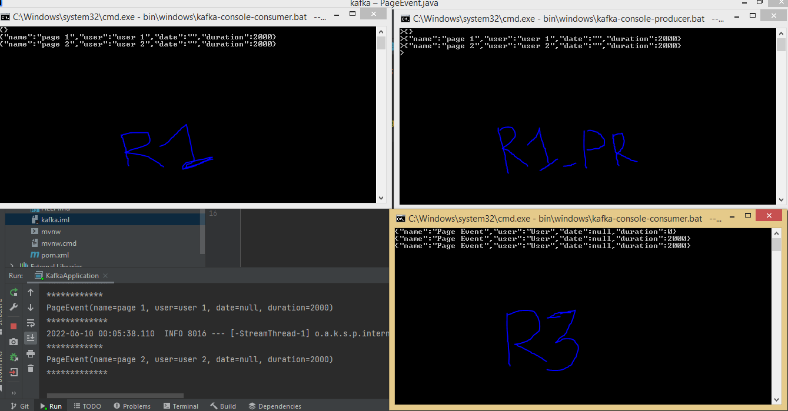
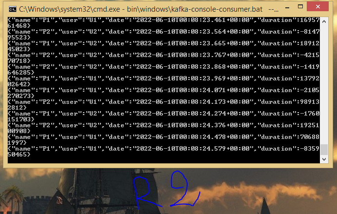
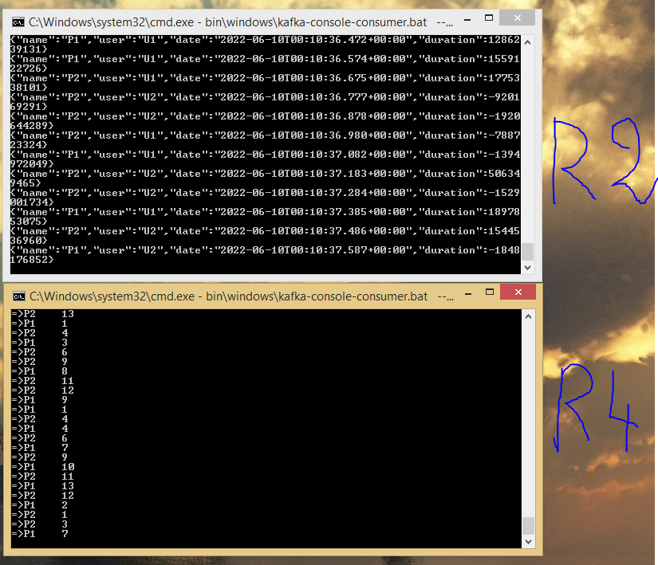
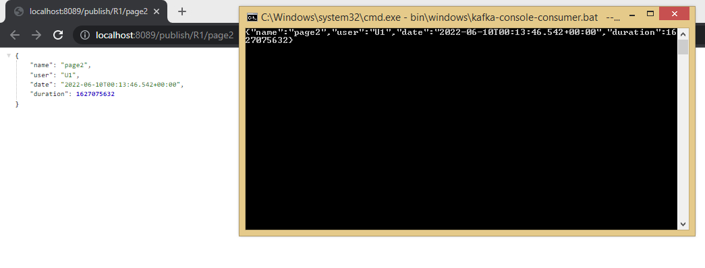
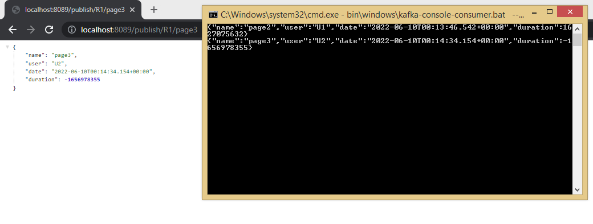
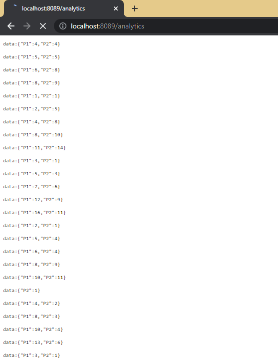
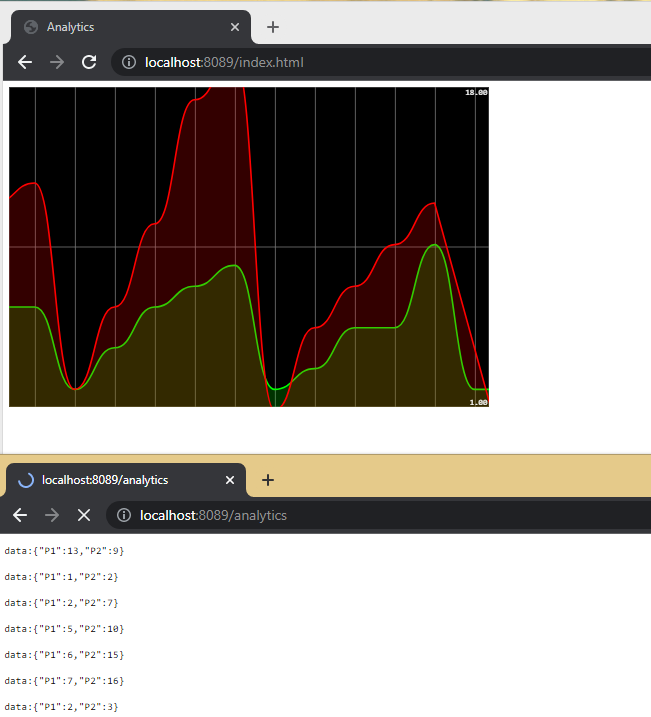

### Run Zookeeper and Kafka
```bash
START bin\windows\zookeeper-server-start.bat config/zookeeper.properties
START bin\windows\kafka-server-start.bat config/server.properties
```
<hr style="border:2px solid gray">

### pageEventConsumer,pageEventFunction
```bash
START bin\windows\kafka-console-consumer.bat --bootstrap-server localhost:9092 --topic R1
START bin\windows\kafka-console-consumer.bat --bootstrap-server localhost:9092 --topic R3
START bin\windows\kafka-console-producer.bat --borker-list localhost:9092 --topic R1
```


<br>
<hr style="border:2px solid gray">

### pageEventSupplier
```bash
START bin\windows\kafka-console-consumer.bat --bootstrap-server localhost:9092 --topic R2
```


<br>
<hr style="border:2px solid gray">

### KStreamFunction
```bash
START bin\windows\kafka-console-consumer.bat --bootstrap-server localhost:9092 --topic R2
START bin\windows\kafka-console-consumer.bat --bootstrap-server localhost:9092 --topic R4
```


<br>
<hr style="border:2px solid gray">

### publish
```bash
START bin\windows\kafka-console-consumer.bat --bootstrap-server localhost:9092 --topic R1
```



<br>
<hr style="border:2px solid gray">

### analytics avec 'Flux'



